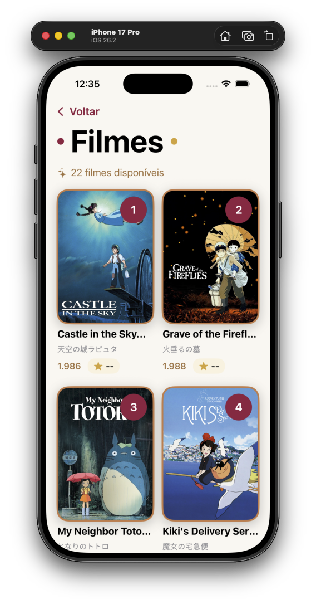
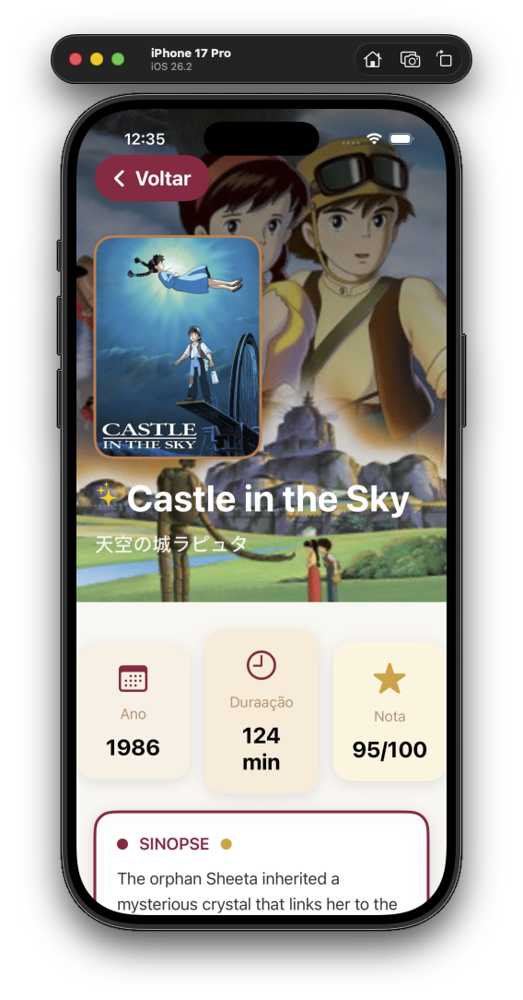

# 🎬 Ghibli Archive

Um aplicativo iOS que exibe o catálogo completo dos filmes do Studio Ghibli, utilizando a [Ghibli API](https://ghibliapi.vercel.app/).

## 📋 Sobre o Projeto

O **Ghibli Archive** é um aplicativo nativo para iOS que permite aos fãs do Studio Ghibli explorar o catálogo completo de filmes do estúdio. O app oferece:

- 📚 Lista completa de todos os filmes do Studio Ghibli
- 🎥 Detalhes completos de cada filme (sinopse, diretor, produtor, duração, rating)
- 🖼️ Imagens e banners dos filmes
- ⚡ Performance otimizada com sistema de cache
- 🌐 Suporte para modo offline após o primeiro carregamento

## 📱 Screenshots

<div align="center">
  
  
  
</div>

<p align="center">
  <em>Interface intuitiva mostrando tela inicial, catálogo completo e detalhes dos filmes</em>
</p>

## 🏗️ Arquitetura

O projeto utiliza uma arquitetura **MVVM (Model-View-ViewModel)** com separação clara de responsabilidades em camadas:

```
┌─────────────────────────────────────────────────────────┐
│                        View Layer                        │
│              (SwiftUI Views + Coordinator)               │
└───────────────────────────┬─────────────────────────────┘
                            │
                            ↓
┌─────────────────────────────────────────────────────────┐
│                     ViewModel Layer                      │
│        (Observable ViewModels - Business Logic)          │
└───────────────────────────┬─────────────────────────────┘
                            │
                            ↓
┌─────────────────────────────────────────────────────────┐
│                      Worker Layer                        │
│            (Data Fetching + Cache Management)            │
└───────────────────────────┬─────────────────────────────┘
                            │
                            ↓
┌─────────────────────────────────────────────────────────┐
│                      Network Layer                       │
│             (NetworkManager - HTTP Requests)             │
└───────────────────────────┬─────────────────────────────┘
                            │
                            ↓
┌─────────────────────────────────────────────────────────┐
│                       Ghibli API                         │
│              https://ghibliapi.vercel.app                │
└─────────────────────────────────────────────────────────┘
```

### 📦 Estrutura de Camadas

#### 1️⃣ **View Layer** (SwiftUI)
Responsável pela interface do usuário e interações:

- **Views**: Componentes visuais em SwiftUI
- **Coordinator**: Gerenciamento de navegação entre telas
- Totalmente declarativa e reativa

#### 2️⃣ **ViewModel Layer**
Gerencia o estado da UI e a lógica de apresentação:

- `FilmCatalogViewModel`: Gerencia a lista de filmes
- `FilmDetailViewModel`: Gerencia os detalhes de um filme específico
- Usa o macro `@Observable` do Swift para reatividade
- Atualiza a UI de forma automática através do `@MainActor`

#### 3️⃣ **Worker Layer** (Camada de Serviço)
Camada intermediária que:

- Busca dados da API através do `NetworkManager`
- **Implementa sistema de cache** para otimização
- Transforma DTOs (Data Transfer Objects) em Models de domínio
- Trata erros de forma específica

**Workers disponíveis:**
- `FilmCatalogWorker`: Busca lista de filmes + cache
- `FilmDetailWorker`: Busca detalhes de um filme específico

#### 4️⃣ **Network Layer**
Camada de comunicação com a API:

- `NetworkManager`: Singleton que gerencia todas as requisições HTTP
- Métodos genéricos com suporte a `async/await`
- Tratamento robusto de erros de rede
- Decodificação automática usando `Codable`
- Logs detalhados em modo DEBUG

#### 5️⃣ **Model Layer**
Modelos de dados:

- **DTOs**: Representam a estrutura JSON da API
  - `FilmListDTO`
  - `FilmDetailDTO`
  
- **Domain Models**: Modelos de domínio da aplicação
  - `FilmListItem`
  - `FilmDetail`

## 🔧 Camada de Serviço (Workers)

### FilmCatalogWorker

Responsável por buscar e gerenciar a lista de filmes:

```swift
protocol FilmCatalogWorkerProtocol {
    func fetchAllFilms() async throws -> [FilmListItem]
    func getTotalFilmsCount() -> Int
}
```

**Funcionalidades:**
- ✅ Busca todos os filmes da API
- 📦 Sistema de cache in-memory
- 🔄 Ordenação automática por ano de lançamento
- ⚡ Retorna dados do cache quando disponível

### FilmDetailWorker

Responsável por buscar detalhes específicos de um filme:

```swift
protocol FilmDetailWorkerProtocol {
    func fetchFilmDetail(apiId: String) async throws -> FilmDetail
}
```

**Funcionalidades:**
- ✅ Busca detalhes completos de um filme
- 🎯 Tratamento de erro 404 (filme não encontrado)
- 📥 Conversão automática de DTO para modelo de domínio

## 💾 Sistema de Cache

O app implementa um **sistema de cache in-memory** para otimizar a performance e reduzir chamadas desnecessárias à API.

### Como Funciona

#### Implementação no `FilmCatalogWorker`:

```swift
private var cachedFilms: [FilmListItem]?
private var cacheTimestamp: Date?
private let cacheValidityDuration: TimeInterval = 300 // 5 minutos
```

#### Fluxo de Cache:

1. **Primeira requisição**: Dados são buscados da API
2. **Cache**: Dados são armazenados em memória com timestamp
3. **Requisições subsequentes**: 
   - Se cache válido (< 5 minutos) → retorna do cache ⚡
   - Se cache expirado → busca novamente da API 🌐

### Benefícios do Cache

✅ **Performance**: Respostas instantâneas após o primeiro carregamento  
✅ **Economia de Dados**: Reduz consumo de internet  
✅ **Experiência do Usuário**: Navegação mais fluida  
✅ **Redução de Carga**: Menos requisições ao servidor  

### Métodos de Cache Disponíveis

```swift
// Limpar cache manualmente
func clearCache()

// Forçar atualização (ignora cache)
func forceRefresh() async throws -> [FilmListItem]

// Verificar quantidade de itens em cache
func getTotalFilmsCount() -> Int
```

### Tempo de Validade

- **Cache atual**: 5 minutos (300 segundos)
- **Tipo**: In-memory (perdido ao fechar o app)
- **Estratégia**: Time-based invalidation

> 💡 **Nota**: O cache é mantido apenas na memória. Ao fechar o app, os dados precisam ser buscados novamente.

## 🛠️ Tecnologias Utilizadas

- **Swift**: Linguagem nativa da Apple
- **SwiftUI**: Framework declarativo para UI
- **Swift Concurrency**: `async/await` para operações assíncronas
- **Observation Framework**: Macro `@Observable` para reatividade
- **URLSession**: Requisições HTTP nativas
- **Codable**: Serialização/deserialização JSON

## 🌐 API Utilizada

O projeto consome a [Ghibli API](https://ghibliapi.vercel.app/):

### Endpoints utilizados:

```
GET /films
```
Retorna a lista completa de filmes

```
GET /films/{id}
```
Retorna detalhes de um filme específico

## 📱 Requisitos

- iOS 17.0+
- Xcode 15.0+
- Swift 5.9+

## 🚀 Como Executar

1. Clone o repositório:
```bash
git clone [URL_DO_REPOSITORIO]
```

2. Abra o projeto no Xcode:
```bash
cd Ghibli-Archive
open Ghibli\ Archive.xcodeproj
```

3. Selecione um simulador ou dispositivo físico

4. Execute o projeto (⌘ + R)

## 🧪 Tratamento de Erros

O app possui tratamento robusto de erros em todas as camadas:

### NetworkError
- `invalidURL`: URL malformada
- `invalidResponse`: Resposta inválida do servidor
- `httpError`: Erros HTTP (404, 500, etc.)
- `decodingError`: Falha ao decodificar JSON
- `timeout`: Tempo esgotado
- `noInternetConnection`: Sem internet

### FilmServiceError
- `networkError`: Encapsula erros de rede
- `filmNotFound`: Filme específico não encontrado
- `unknown`: Erros inesperados

Todos os erros implementam `LocalizedError`, fornecendo mensagens amigáveis ao usuário.

## 📂 Estrutura de Pastas

```
Ghibli Archive/
├── App/
│   └── Ghibli_ArchiveApp.swift
├── Coordinators/
│   └── AppCoordinator.swift
├── Views/
│   ├── InitialScreen.swift
│   ├── FilmCatalogView.swift
│   └── FilmDetailView.swift
├── ViewModels/
│   ├── FilmCatalogViewModel.swift
│   └── FilmDetailViewModel.swift
├── Workers/
│   ├── FilmCatalogWorker.swift
│   └── FilmDetailWorker.swift
├── Networking/
│   └── NetworkManager.swift
└── Models/
    ├── FilmCatalogModel.swift
    └── FilmDetailModel.swift
```

## 🎯 Próximas Melhorias

- [ ] Persistência de cache com CoreData ou SwiftData
- [ ] Suporte a busca/filtro de filmes
- [ ] Favoritos salvos localmente
- [ ] Modo escuro otimizado
- [ ] Testes unitários
- [ ] Testes de UI com Swift Testing
- [ ] Animações e transições aprimoradas

## 👨‍💻 Desenvolvedor

**Guilherme Gonçalves de Oliveira Junior**

---
